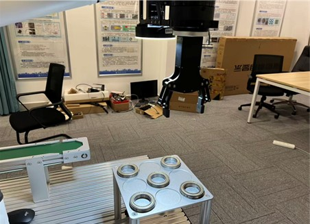
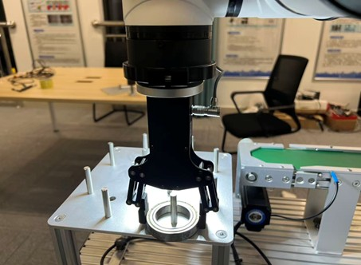
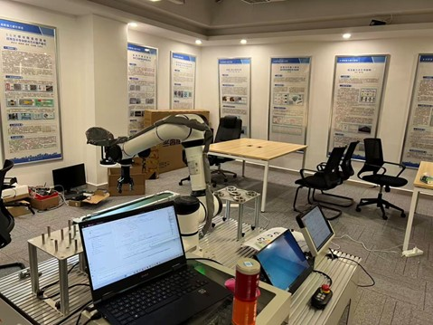
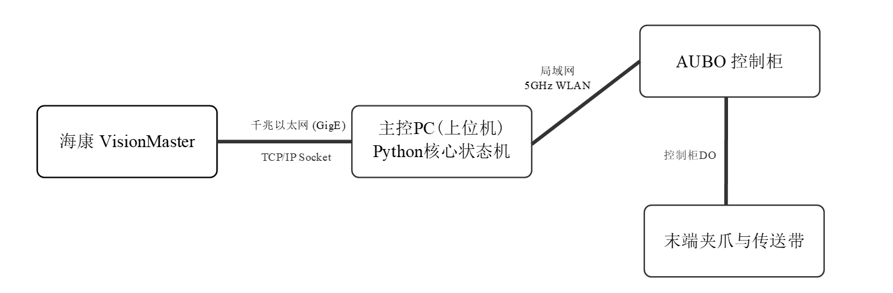
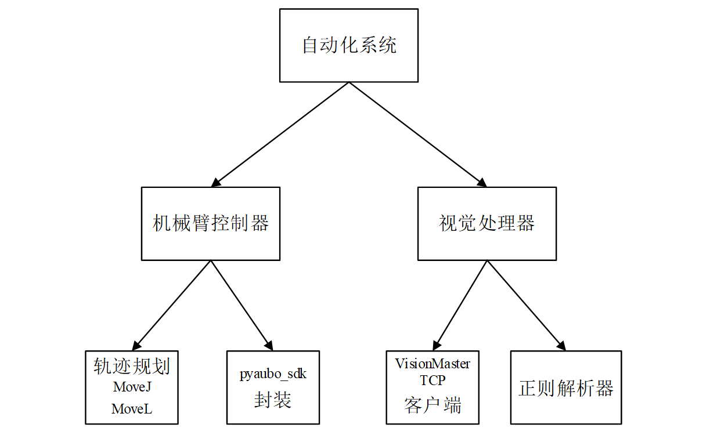
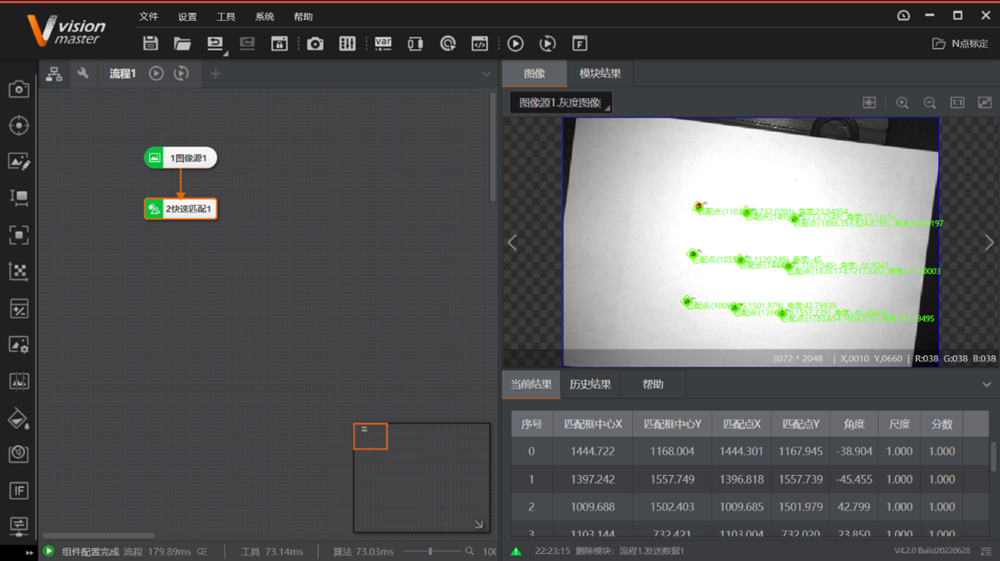
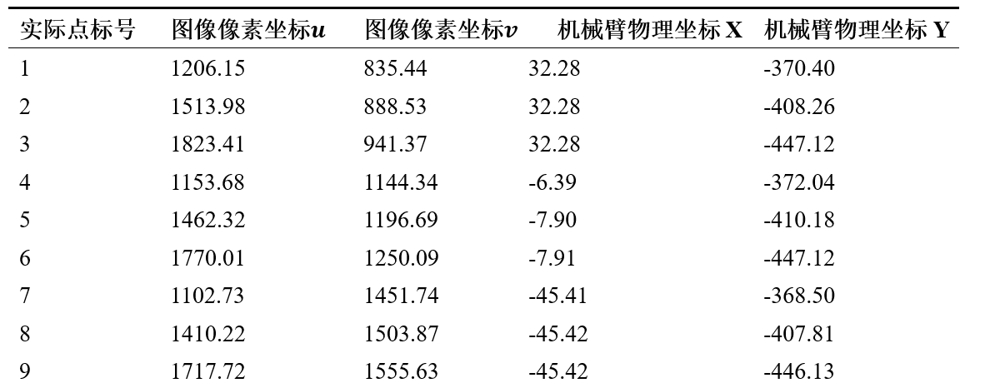
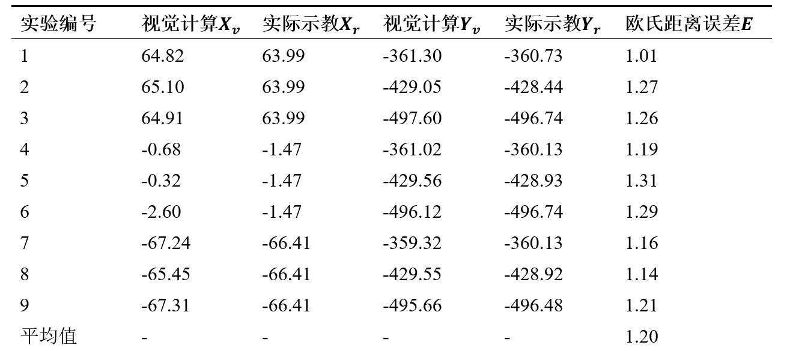
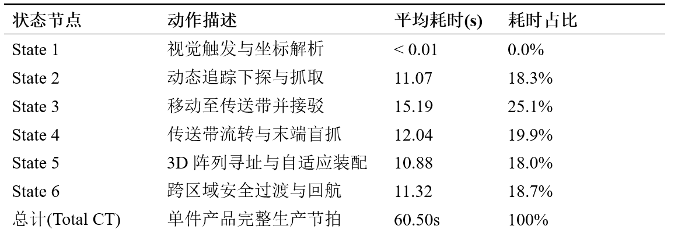

# 基于 AUBO ARCS 与视觉定位的六轴机械臂自动控制系统

> 武汉科技大学 计算机科学与技术 2026届 毕业设计  
> 独立开发 · 2026.01 – 2026.05

面向工业上下料场景,独立设计并实现**"视觉识别 — 机械臂抓取 — 传送带接驳 — 3D 阵列装配"** 全流程闭环控制系统。基于 Python 上位机统一调度 4 条异构通信链路,完成软硬件协同的工程落地。

---

## 项目演示

| 装配台与铁杆阵列 | 末端夹爪抓取轴承 | 实验现场全景 |
| :---: | :---: | :---: |
|  |  |  |

---

## 关键指标

| 指标 | 数值 |
| :--- | :--- |
| 9 点验证集平均定位误差 | **1.20 mm**(最大 1.31,最小 1.01) |
| 连续装配成功率(15 次) | **100%** |
| 单次完整 Cycle Time | **60.5 s** |
| 人机协作力控阈值 | 250 N |

---

## 系统架构

### 硬件拓扑



整个系统由 **海康 VisionMaster(视觉)、Python 上位机(主控)、AUBO 控制柜(机械臂)、末端夹爪与传送带(执行)** 四部分组成,上位机作为中央调度,统一管理 4 条异构通信链路:

| 链路 | 协议 | 用途 |
| :--- | :--- | :--- |
| VisionMaster ↔ 上位机 | **TCP Socket** | 接收 VisionMaster 透传的像素坐标 |
| 上位机 ↔ 机械臂控制柜 | **AUBO RPC** | 位姿下发、关节状态回读、IK 求解 |
| 上位机 ↔ 气动夹爪 | **Modbus 输出信号** | 夹爪开合控制 |
| 上位机 ↔ 传送带 | **数字 IO** | 传送带启停 |

### 软件架构



软件分为 **机械臂控制器** 与 **视觉处理器** 两大模块,各自独立封装,主流程通过 6 阶段状态机统一调度。

---

## 核心技术亮点

### 1. 九点仿射标定

基于 OpenCV `cv2.estimateAffine2D`,采集 9 对 "像素坐标 ↔ 机械臂物理坐标" 对应点,构造超定方程组,通过最小二乘法拟合 2×3 仿射变换矩阵,实现像素空间到机械臂基坐标系的映射。



**采集数据**(节选,完整 9 点):



针对实验室昼夜光照引起的视觉漂移,通过示教器实测 Y 轴 -1.5mm 的系统性偏差,引入 **静态偏移补偿** 矫正,确保不同时段抓取一致性。

### 2. 逆运动学多解择优

AUBO SDK 的 `inverseKinematics` 接口对同一目标位姿可返回多组候选关节解。直接采用任意一组可能导致机械臂大幅翻转或经过奇异区。

本项目在应用层做了择优策略——遍历所有候选解,计算每组解相对当前姿态的 **关节空间欧氏距离**(各关节变化量绝对值之和),选择变化量最小的一组下发执行。

```python
best_solution = None
min_delta = float('inf')
for sol in ik_solutions:
    delta = sum(abs(s - c) for s, c in zip(sol, curr_joints))
    if delta < min_delta:
        min_delta = delta
        best_solution = sol
```

效果:运动更平滑,显著降低路径穿越奇异点的概率。

### 3. MoveJoint / MoveLine 混合轨迹规划

不同运动场景采用不同插补方式,在效率与精度之间取得平衡:

| 运动模式 | 适用场景 | 设计考量 |
| :--- | :--- | :--- |
| **MoveJoint**(关节空间) | 大跨度移动、跨工作台过渡 | 走关节空间插值,**规避笛卡尔直线穿越奇异点** |
| **MoveLine**(笛卡尔空间) | 抓取下探、放料拔起 | 末端走直线,**保证精准定位与下探安全** |

跨工作台的大跨度回航采用 **安全过渡点策略**——先 MoveJoint 到中间过渡点,再到目标点,绕开奇异区死锁。

### 4. 基于 TCP 位姿轮询的物理到位判定

AUBO SDK 的运动指令是 **异步** 的——函数立即返回,但机械臂仍在物理运动中。若不等待到位就触发下一指令(如夹爪闭合),会出现"未到位即抓取"的严重错误。

解决方案:每 100ms 查询一次末端 TCP 实际位姿,计算与目标点的 **欧氏距离**,小于 1.5mm 视为到位,并配置 30s 超时兜底防止卡死。

```python
while time.time() - start < timeout:
    curr_pose = self.robot.getRobotState().getTcpPose()
    curr_xyz = [curr_pose[i] * 1000 for i in range(3)]
    dist = sum((a - b) ** 2 for a, b in zip(curr_xyz, target_xyz)) ** 0.5
    if dist < ARRIVAL_TOLERANCE_MM:
        break
    time.sleep(ARRIVAL_POLL_INTERVAL)
```

### 5. 3D 阵列动态寻址

装配台 3 根铁杆需支持多层堆叠。采用 **取模 + 整除** 实现水平位置与堆叠层数的解耦计算,以单一公式支持任意层数堆叠,替代传统 PLC 梯形图的硬编码方式。

```python
peg_index   = self.assembly_count % total_pegs     # 取模 → 水平位置
stack_level = self.assembly_count // total_pegs    # 整除 → 堆叠层数
drop_z = target_peg[2] + stack_level * STACK_HEIGHT_PER_LAYER
```

### 6. Socket 缓冲清空机制

机械臂运动期间(约 60 秒/轮),VisionMaster 可能因误触发产生过期坐标进入 socket 接收缓冲。若不处理,下一轮 Cycle 启动时会读到 **指向已抓走轴承位置** 的脏数据。

每轮 Cycle 结束后,通过非阻塞读将缓冲区清空,保证下一轮处理的始终是最新视觉数据。

### 7. 上下文管理器实现阶段级 Profiling

使用 Python 上下文管理器(`__enter__` / `__exit__`)封装阶段计时器,让计时逻辑与业务逻辑解耦,主流程保持干净的同时获得完整的 Cycle Time 拆解数据。

```python
with self.timer.stage("3D阵列装配"):
    self._assemble_to_peg()
```

---

## 测试结果

### 视觉定位精度

9 点验证集实测,**欧氏距离平均误差 1.20mm,最大 1.31mm,最小 1.01mm**:



### Cycle Time 拆解

完整装配循环各阶段平均耗时:



State 3 + State 4(传送带接驳与末端盲抓)合计占比 **45%**,为主要瓶颈;后续可通过提升传送带速度与抓取速度优化至 20s 左右。

### 可靠性

连续 15 次完整装配循环,**100% 成功率**,无碰撞、无误抓、无掉件。

---

## 项目结构

```
MechanicalArm/
├── core_backend.py            # 主控逻辑:状态机、运动控制、IO 调度
├── utils.py                   # NPointTransform:九点标定矩阵加载与坐标转换
├── config.py                  # 全部配置:IP、坐标点位、速度、IO 地址
├── run_9point_calibration.py  # 九点标定脚本:采集像素-物理坐标对生成矩阵
├── n_point_matrix.npy         # 标定生成的 2×3 仿射变换矩阵
└── images/                    # 项目演示图
```

| 文件 | 核心内容 |
| :--- | :--- |
| `core_backend.py` | `VisionProcessor`、`AuboController`、`StageTimer`、`AutomationSystem` |
| `utils.py` | `NPointTransform`(矩阵加载、像素到机械臂坐标转换) |
| `config.py` | 机械臂 IP、姿态锁定 RX/RY/RZ、9 个铁杆点位、视觉补偿等 |

---

## 技术栈

- **语言**:Python 3.9
- **机械臂 SDK**:`pyaubo_sdk`(AUBO i5)
- **视觉**:海康 VisionMaster 4.2 + OpenCV
- **通信**:TCP Socket / AUBO RPC / Modbus / 数字 IO
- **平台**:Windows 10

---

## 关于本仓库

本仓库为 2026 年 5 月对毕业设计代码的整理与开源。代码本身完成于 2026 年 1–5 月,早期开发以本地版本管理为主,毕业前完成项目结构整理、文档撰写后统一上传 GitHub。

`config.py` 中机械臂 IP、登录密码等敏感信息已替换为占位符,实际部署时需按现场环境填写。

---

## 联系方式

**浦京** · 1031720369@qq.com
